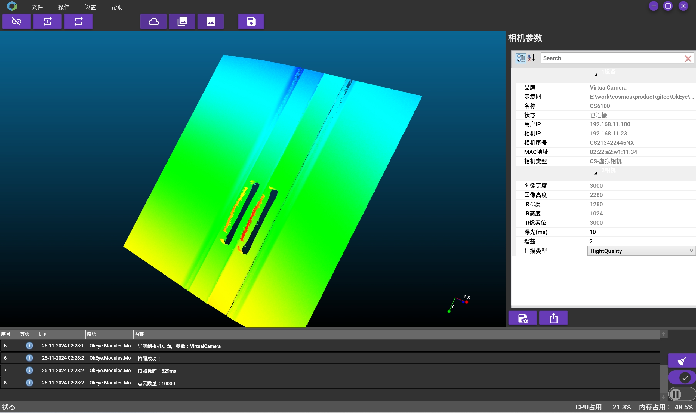
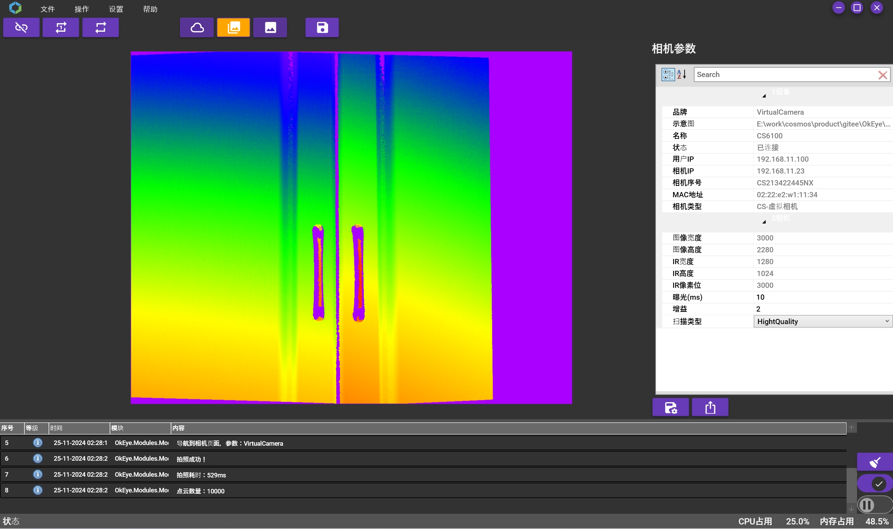

# OkEye

## 软件简介

OkEye 是一个3D相机查看平台，支持相机发现，连接相机，查看相机图片、点云、深度图等功功能；支持单次拍照、连续拍照、保存图片、保存点云、保存深度图等功能。
OkEye基于Prism架构开发，支持插件化开发，用户可以根据自己的需求开发插件，扩展OkEye的功能。支持各类相机品牌型号接入，相机接口化标准。

## 运行环境
开发环境：Visual Studio 2022
依赖库：Prism、VL.OpenCV、Activiz
操作系统：Windows 10/11

## 软件演示
软件演示，如下图所示：

## 软件界面
软件主界面，如下图所示：

软件相机点云界面，如下图所示：

软件相机深度图界面，如下图所示：

软件相机图像界面，如下图所示：

软件关于界面，如下图所示：
