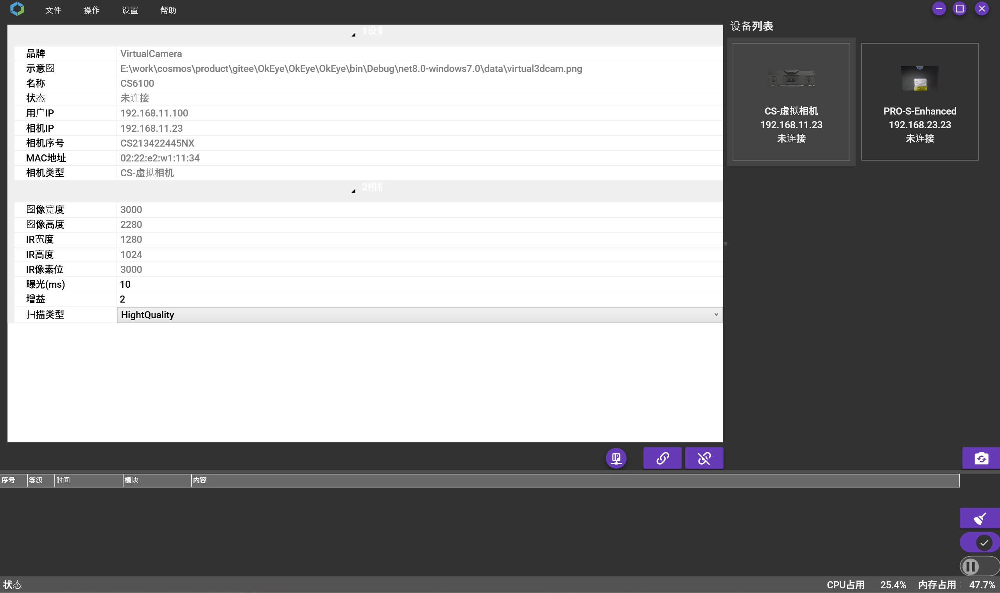
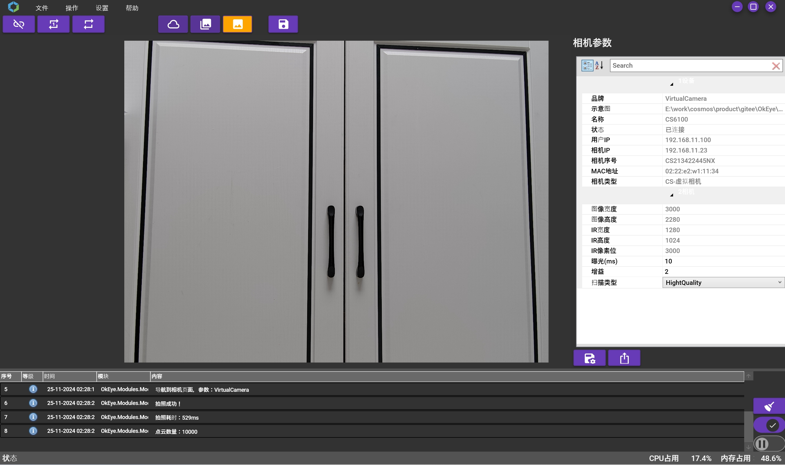

 
> OkEye - OkEye的用户界面设计直观且易于使用，即使是初次接触3D视觉技术的用户也能迅速掌握。该平台提供灵活的API接口，允许开发者通过编程方式控制相机和处理数据，实现自动化和定制化的应用。此外，OkEye还拥有强大的数据处理能力，能够实时分析和处理采集到的图像和点云数据，为用户提供即时的视觉反馈。其稳定性和兼容性已经过严格测试，确保在各种工业环境中都能可靠运行。

# OkEye

## 目录

1. [软件简介](#section_1)
2. [软件功能](#section_2)
3. [运行环境](#section_3)
4. [软件演示](#section_4)
5. [软件界面](#section_5)

## 软件简介
OkEye 是一个3D相机查看平台，提供相机发现、连接相机以及查看相机图片、点云、深度图等功能；同时支持单次拍照、连续拍照、保存图片、保存点云、保存深度图等操作。基于Prism架构开发的OkEye，支持插件化开发，使用户能够根据个人需求开发定制插件，以扩展平台功能。它兼容多种相机品牌和型号，并遵循相机接口化标准。

## 软件功能

设备管理
* 发现设备
* 设备链接
* 设备断开
    
相机管理
* 单次拍照
* 连续拍照
* 点云显示
* 深度图显示
* 图像显示
* 相机参数设置

## 运行环境
开发环境：Visual Studio 2022
依赖库：Prism、VL.OpenCV、Activiz
操作系统：Windows 10/11

## 软件演示
软件演示，如下图所示：

## 软件界面
软件主界面，如下图所示：

软件相机点云界面，如下图所示：

软件相机深度图界面，如下图所示：

软件相机图像界面，如下图所示：

软件关于界面，如下图所示：

