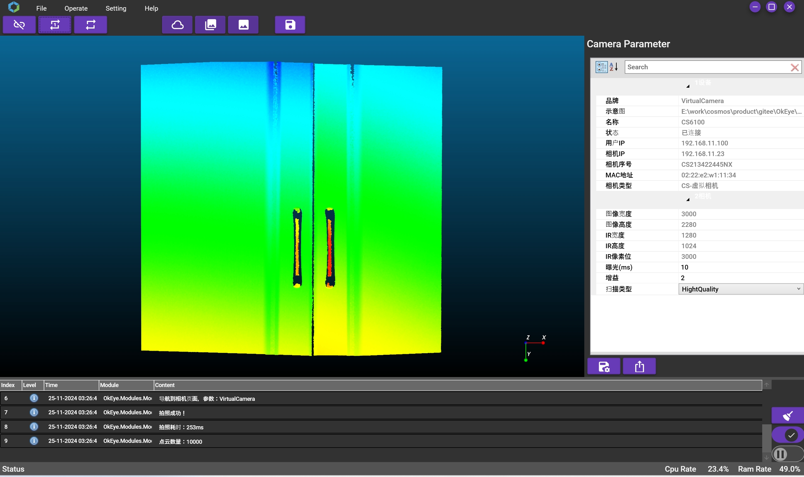

 
> OkEye - OkEye 3D Camera Viewer
# OkEye

##	INDEX

1. [Introduction](#section_1)
2. [Function](#section_2)
3. [Environment](#section_3)
4. [Demo](#section_4)
5. [Surface](#section_5)

## Introduction
OkEye is a 3D camera viewer platform based on the Prism architecture, supporting virtual camera, camera discovery, camera connection, and viewing camera images, point clouds, depth maps, etc. It also supports single shot, continuous shot, save image, save point cloud, save depth map, etc. Developed based on the Prism architecture, 
OkEye supports plug-in development, allowing users to develop custom plug-ins to extend the platform's functionality. It is compatible with multiple camera brands and models and follows the camera interface standard. 

## Function

Application Management
* Application startup * Application shutdown * Application restart * Application exit * Application language switching *Application Theme Switching
Device management
* Device scanning * Device Connection * Device Disconnection * Device Information Display * Application Setting
Camera management
* Single shot * Continuous shot * Point cloud display * Depth map display * Image display * Camera parameter setting

## Evnironment
IDE ：Visual Studio 2022
Dependency ：Prism、VL.OpenCV、Activiz
Operation System ：Windows 10/11

## Demo
The software demo is as follows:

## Surface
Software main interface, as shown in the following figure:

Software camera cloud interface, as shown in the following figure:

Software Camera Depth Map Interface, as shown in the following figure:

Software camera image interface, as shown in the following figure:

Software multi-language support, as shown in the following figure:

Software IpConfig interface, as shown in the following figure:

Software About interface, as shown in the following figure:

